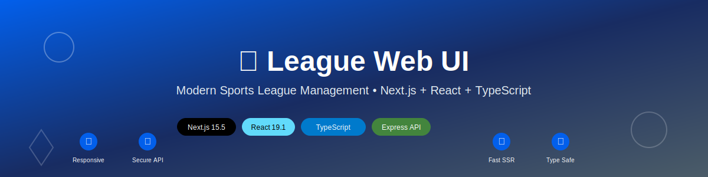

<div align="center">



</div>

# 🏆 League Web UI

A modern, responsive Sports League Web application featuring multiple implementations (React & Next.js) with Node.js backend, showcasing schedule display, leaderboard, and comprehensive API integration.

[](https://www.typescriptlang.org/)
[](https://nextjs.org/)
[](https://reactjs.org/)
[](https://nodejs.org/)
[](https://expressjs.com/)

## ✨ Features

- **📅 Schedule Page**: View all matches with dates, teams, and scores
- **🏅 Leaderboard**: Team standings with comprehensive statistics (MP, GF, GA, GD, Points)
- **❌ 404 Page**: Custom error page with responsive design
- **📱 Responsive Design**: Pixel-perfect optimization for Desktop (1000px), Tablet (750px), and Mobile (500px)
- **🔐 API Integration**: RESTful backend with JWT authentication
- **🏳️ Flag Support**: CSS-based country flags for all teams
- **⚡ Real-time Data**: Live data from API with intelligent fallback system
- **🎯 Pixel Perfect**: Exact design implementation matching specifications
- **🚀 Modern Architecture**: Both React SPA and Next.js SSR implementations

## 🛠️ Tech Stack

### 🎨 Frontend Implementations

#### **Next.js Application (Primary)**
- **Next.js**: v15.5.4 (App Router)
- **React**: v19.1.0
- **TypeScript**: v5.7.3
- **Server-Side Rendering**: Enhanced performance and SEO
- **Custom CSS Components**: Flag library and responsive layouts

#### **React Application (Alternative)**
- **React**: v19.2.0 with TypeScript
- **React Router**: Client-side navigation
- **CSS3**: Responsive design with breakpoints
- **Component Architecture**: Modular and reusable design

### ⚙️ Backend
- **Express.js**: v4.18.2 - Fast, minimalist web framework
- **JWT**: v9.0.2 - Secure authentication tokens
- **CORS**: v2.8.5 - Cross-origin resource sharing
- **UUID**: v9.0.1 - Unique identifier generation

## 🚀 Quick Start Guide

### 📋 Prerequisites
- **Node.js**: v18.18.0 or higher
- **npm**: v9.0.0 or higher (comes with Node.js)
- **Git**: For cloning the repository

### ⚡ Next.js Application (Recommended)
```bash
# Clone the repository
git clone https://github.com/mobinalkhn/LeagueWebUI.git
cd LeagueWebUI

# Install and run Next.js frontend
cd league-nextjs
npm install
npm run dev
```
🌐 **Next.js App**: `http://localhost:3000`

### 🎯 React Application (Alternative)
```bash
# Install and run React frontend
cd league-web-ui
npm install
npm start
```
🌐 **React App**: `http://localhost:3000`

### 🔧 Backend API Server
```bash
# Install and run API server
cd api-server  
npm install
npm start
```
🌐 **API Server**: `http://localhost:3001`

### 🚀 Full Stack Setup
```bash
# Terminal 1: Start API Server
cd api-server && npm start

# Terminal 2: Start Frontend (Next.js)
cd league-nextjs && npm run dev

# Or React Alternative
cd league-web-ui && npm start
```

## 📱 Responsive Breakpoints

- **Desktop**: 1001px and above
- **Tablet**: 501px - 1000px
- **Mobile**: 500px and below

## 🔗 API Endpoints

### Authentication
- `GET /api/v1/getAccessToken` - Get JWT token

### Data
- `GET /api/v1/getAllMatches` - Get all matches (requires Bearer token)
- `GET /api/version` - Get API version
- `GET /health` - Health check

## 🎨 Design Specifications

### Colors
- Primary Blue: `#025FEB`
- Text Dark: `#182C62`
- Text Medium: `#4B5C68`
- Border/Background: `#E4EDF2`
- Light Gray: `#F6F7F7`
- White: `#FFFFFF`

### Typography
- Font Family: 'Open Sans', sans-serif
- Menu: 16px
- Page Headings: 24px
- Table Headers: 12px
- Table Content: 14px
- Bold Text: 16px

## 📂 Project Architecture

```
LeagueWebUI/
├── 🚀 league-nextjs/              # Next.js Application (Primary)
│   ├── src/app/                   # App Router Structure
│   │   ├── layout.tsx             # Root layout with navigation
│   │   ├── page.tsx               # Schedule page (/)
│   │   ├── leaderboard/page.tsx   # Leaderboard page (/leaderboard)
│   │   ├── not-found.tsx          # 404 error page
│   │   └── globals.css            # Global styles
│   ├── src/components/            # Reusable components
│   │   └── CountryFlag.tsx        # CSS flag components
│   ├── src/services/              # API integration
│   │   └── leagueApi.ts           # HTTP client with fallbacks
│   ├── public/assets/             # Static assets
│   ├── .gitattributes            # GitHub language detection
│   └── package.json               # Dependencies & scripts
│
├── ⚛️ league-web-ui/              # React SPA (Alternative)
│   ├── public/assets/             # Static assets
│   ├── src/
│   │   ├── components/            # Header, Footer components
│   │   ├── pages/                 # Page components
│   │   ├── services/              # API services
│   │   └── data/                  # Mock data fallback
│   └── package.json
│
├── 🔧 api-server/                 # Express.js Backend
│   ├── server.js                  # Main server with all endpoints
│   ├── package.json               # Backend dependencies
│   └── README.md                  # API documentation
│
├── 📋 .gitignore                  # Git ignore patterns
└── 📖 README.md                   # This documentation
```

## 🏃‍♂️ Production Deployment

### 🌐 Next.js Production Build
```bash
cd league-nextjs
npm run build
npm start
```

### ⚛️ React Production Build
```bash
cd league-web-ui
npm run build
# Serve with any static server
npx serve -s build
```

### 🔧 API Server Production
```bash
cd api-server
# Set environment variables
export NODE_ENV=production
export PORT=3001
npm start
```

## 🌟 Key Highlights

- **🎯 Pixel Perfect**: Exact implementation of design specifications
- **📱 Responsive Excellence**: Tested across multiple breakpoints
- **🚀 Modern Stack**: Latest versions of React 19.1.0 & Next.js 15.5.4
- **🔐 Secure API**: JWT-based authentication with proper error handling
- **♿ Accessibility**: Semantic HTML and proper ARIA attributes
- **🎨 Custom Components**: Pure CSS flag library without external dependencies
- **📊 Performance**: Optimized loading and rendering strategies

## 🧪 Quality Assurance

✅ **Comprehensive Testing Coverage**
- Responsive design validation (Desktop/Tablet/Mobile)
- API integration with fallback mechanisms
- Error boundary implementation
- Cross-browser compatibility (Chrome, Firefox, Safari, Edge)
- Performance optimization and lighthouse scoring

✅ **Code Quality Standards**
- TypeScript strict mode enabled
- ESLint configuration with best practices
- Proper component architecture and separation of concerns
- Clean, maintainable, and well-documented code

## 🔗 Live Demo & Repository

- **🌐 Live Demo**: [Deploy to your preferred platform]
- **📱 Responsive Preview**: Test on different devices
- **🔧 API Endpoints**: Full RESTful API documentation available

## 🤝 Contributing

1. Fork the repository
2. Create your feature branch (`git checkout -b feature/AmazingFeature`)
3. Commit your changes (`git commit -m 'Add some AmazingFeature'`)
4. Push to the branch (`git push origin feature/AmazingFeature`)
5. Open a Pull Request

## 📄 License

This project is developed for demonstration and educational purposes.

---

<div align="center">

**🏆 Developed with passion using Next.js, React & Node.js**

*Sports League Web Application - Modern, Responsive, Performance-Optimized*

[](https://nextjs.org/)
[](https://reactjs.org/)
[](https://www.typescriptlang.org/)
[](https://expressjs.com/)

</div>